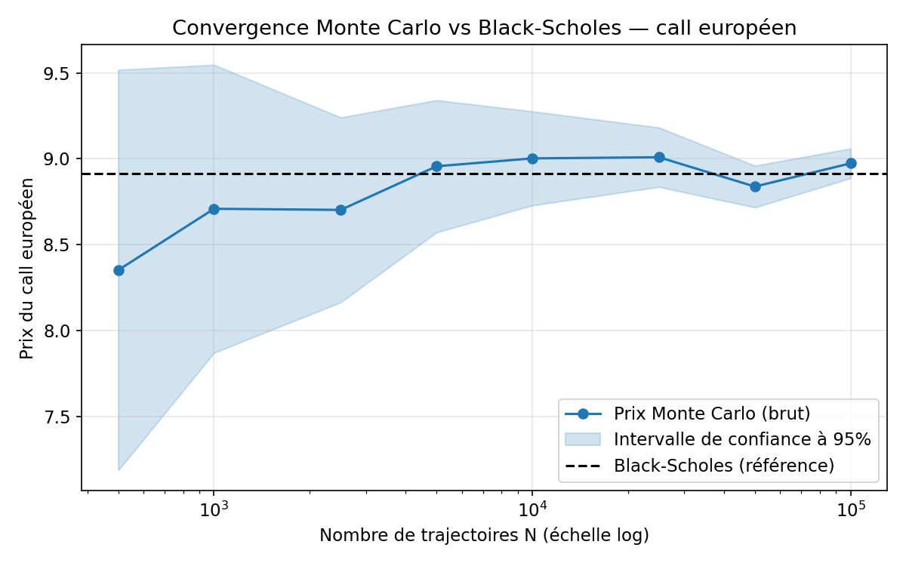
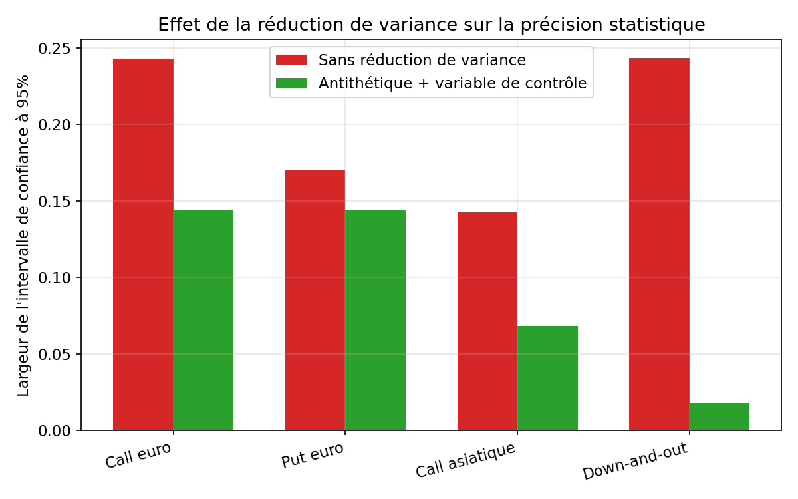
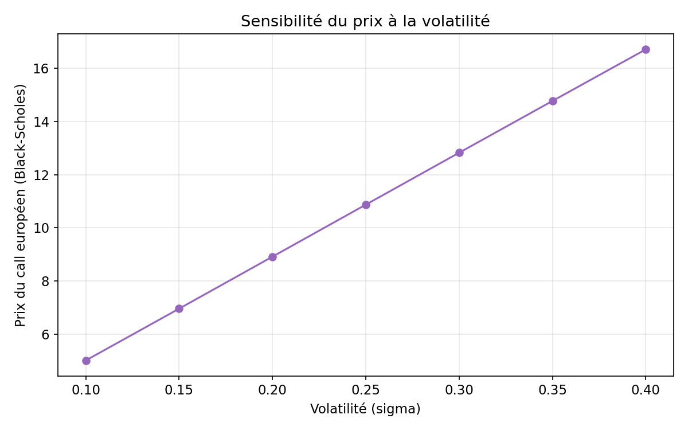
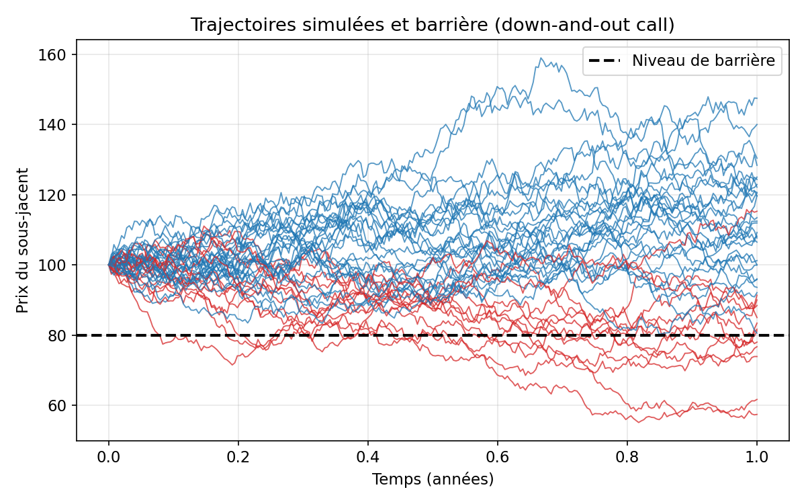

# Pricing Monte Carlo et calcul des Greeks pour options européennes et exotiques

Projet Python de finance quantitative consacré au pricing d'options dans le cadre Black-Scholes, avec simulation Monte Carlo, calcul des principaux Greeks, réduction de variance et génération automatique de résultats exploitables.

L'objectif du dépôt est de proposer un travail académique sérieux, propre et défendable à l'oral, adapté à un profil de Master souhaitant valoriser un intérêt pour :

-   le pricing de produits dérivés ;
-   les méthodes numériques ;
-   la simulation Monte Carlo ;
-   la gestion des risques de marché ;
-   la finance quantitative appliquée.

## Sommaire

1.  [Vue d'ensemble](#vue-densemble)
2.  [Ce que fait le projet](#ce-que-fait-le-projet)
3.  [Cadre quantitatif](#cadre-quantitatif)
4.  [Méthodes retenues](#méthodes-retenues)
5.  [Résultats clés](#résultats-clés)
6.  [Aperçu visuel](#aperçu-visuel)
7.  [Architecture du dépôt](#architecture-du-dépôt)
8.  [Installation et exécution](#installation-et-exécution)
9.  [Sorties générées](#sorties-générées)
10. [Compétences mises en évidence](#compétences-mises-en-évidence)
11. [Limites du projet](#limites-du-projet)
12. [Extensions naturelles](#extensions-naturelles)

## Vue d'ensemble {#vue-densemble}

Le projet repose sur une idée simple : partir d'un cadre théorique standard mais solide, puis le traduire en un pipeline quantitatif complet et lisible.

La logique retenue est la suivante :

1.  utiliser Black-Scholes comme cadre de référence ;
2.  pricer des options européennes par formule fermée et par Monte Carlo ;
3.  étendre l'approche à des options exotiques simples mais intéressantes ;
4.  calculer les sensibilités principales ;
5.  étudier la précision statistique des estimateurs ;
6.  montrer l'effet concret de techniques de réduction de variance ;
7.  produire des tableaux, des figures et un rapport final.

Le projet n'a pas été pensé comme une démonstration artificiellement ambitieuse. Il cherche plutôt à montrer une bonne maîtrise des fondamentaux, un code propre et une vraie capacité d'interprétation.

## Ce que fait le projet {#ce-que-fait-le-projet}

Le pipeline complet permet de :

-   pricer un call européen et un put européen par Monte Carlo ;
-   comparer les prix Monte Carlo à la formule fermée de Black-Scholes ;
-   pricer un call asiatique arithmétique ;
-   pricer un down-and-out call ;
-   calculer Delta, Gamma, Vega et Theta ;
-   construire des intervalles de confiance Monte Carlo ;
-   comparer plusieurs estimateurs avec et sans réduction de variance ;
-   analyser la convergence selon le nombre de trajectoires ;
-   étudier la sensibilité des prix à la volatilité, à la maturité et au strike ;
-   générer automatiquement des tableaux CSV / Markdown, des figures PNG et un rapport final.

## Cadre quantitatif {#cadre-quantitatif}

Le projet se place dans le cadre Black-Scholes standard, sous mesure risque-neutre. L'idée n'est pas seulement d'obtenir des prix, mais de montrer une compréhension correcte du lien entre modélisation, simulation et valorisation.

### Dynamique du sous-jacent

Sous la mesure risque-neutre $Q$, le sous-jacent suit un mouvement brownien géométrique :

``` {.latex .math}
dS_t = r S_t\,dt + \sigma S_t\,dW_t^Q
```

où :

-   $S_t$ désigne le prix du sous-jacent au temps $t$ ;
-   $r$ est le taux sans risque constant ;
-   $\sigma$ est la volatilité constante ;
-   $W_t^Q$ est un mouvement brownien standard sous $Q$.

La solution exacte à maturité s'écrit :

``` math
S_T = S_0 \exp\left(\left(r - \frac{1}{2}\sigma^2\right)T + \sigma \sqrt{T}\,Z\right),
\qquad Z \sim \mathcal{N}(0,1)
```

Cette écriture est utilisée directement dans le code pour les produits européens (`simulate_terminal`), et étendue pas à pas via le même schéma exact pour les produits path-dependent (`simulate_paths`) — il n'y a donc aucun biais de discrétisation lié à un schéma d'Euler, à surveillance de barrière discrète près (cf. [Limites du projet](#limites-du-projet)).

### Pricing risque-neutre

Pour un payoff $\Phi$, le prix à la date initiale est donné par :

``` math
V_0 = e^{-rT}\,\mathbb{E}^Q[\Phi]
```

Dans le cas européen, $\Phi$ dépend uniquement de $S_T$. Dans le cas exotique, il peut dépendre de toute la trajectoire :

``` math
V_0 = e^{-rT}\,\mathbb{E}^Q\left[\Phi\left(S_{t_1},\dots,S_{t_m}\right)\right]
```

### Estimateur Monte Carlo

Si $X_i$ désigne le payoff actualisé simulé sur la trajectoire $i$, l'estimateur Monte Carlo est :

``` math
\widehat{V}_N = \frac{1}{N}\sum_{i=1}^{N} X_i
```

avec ici :

``` math
X_i = e^{-rT}\,\Phi^{(i)}
```

L'erreur statistique décroît en ordre :

``` math
\mathcal{O}\left(\frac{1}{\sqrt{N}}\right)
```

et l'intervalle de confiance approximatif à 95 % est de la forme :

``` math
\widehat{V}_N \pm 1.96 \times \frac{\widehat{\sigma}_X}{\sqrt{N}}
```

où $\widehat{\sigma}_X$ désigne l'écart-type empirique des payoffs actualisés.

**Point technique important (variables antithétiques) :** lorsque l'échantillon est construit par variables antithétiques (paires $Z_i, -Z_i$), calculer $\widehat{\sigma}_X$ sur l'échantillon "aplati" ignore la corrélation négative entre les deux membres de chaque paire et sous-estime donc la réduction de variance réellement obtenue. Le code sépare cet estimateur (`mc_estimator_antithetic`, moyennes de paires) de l'estimateur i.i.d. standard (`mc_estimator`) — voir `src/monte_carlo.py` et le test `tests/test_monte_carlo.py::test_naive_pooling_hides_antithetic_benefit`, qui documente explicitement le piège.

### Formule de Black-Scholes

Pour les options européennes, le projet compare les estimations Monte Carlo à la formule fermée de Black-Scholes.

En posant :

``` math
d_1 = \frac{\ln(S_0/K) + \left(r + \frac{1}{2}\sigma^2\right)T}{\sigma \sqrt{T}},
\qquad
d_2 = d_1 - \sigma \sqrt{T}
```

on obtient :

``` math
C = S_0 N(d_1) - K e^{-rT} N(d_2)
```

``` math
P = K e^{-rT} N(-d_2) - S_0 N(-d_1)
```

Cette comparaison joue un rôle important dans le projet : elle sert de validation numérique du moteur Monte Carlo sur les produits vanilles.

### Greeks principaux

Pour les européennes, les sensibilités analytiques utilisées comme benchmark sont :

``` math
\Delta_{\text{call}} = N(d_1),
\qquad
\Delta_{\text{put}} = N(d_1) - 1
```

``` math
\Gamma = \frac{n(d_1)}{S_0 \sigma \sqrt{T}}
```

``` math
\text{Vega} = S_0\,n(d_1)\sqrt{T}
```

``` math
\Theta_{\text{call}} = -\frac{S_0 n(d_1)\sigma}{2\sqrt{T}} - r K e^{-rT}N(d_2)
```

où $N(\cdot)$ est la fonction de répartition de la loi normale standard et $n(\cdot)$ sa densité.

Pour les produits exotiques, le projet utilise une approche robuste de type bump-and-revalue, avec **nombres aléatoires communs** entre les scénarios bumpés (même seed réutilisée à chaque évaluation) afin de réduire le bruit de l'estimation :

``` math
\Delta \approx \frac{V(S_0+h)-V(S_0-h)}{2h},
\qquad
\Gamma \approx \frac{V(S_0+h)-2V(S_0)+V(S_0-h)}{h^2}
```

``` math
\text{Vega} \approx \frac{V(\sigma+h_\sigma)-V(\sigma-h_\sigma)}{2h_\sigma}
```

Ce choix est volontairement pédagogique : il est plus simple à expliquer et suffisamment robuste pour un projet de niveau Master.

## Méthodes retenues {#méthodes-retenues}

### Cadre de modélisation

-   sous-jacent sous mouvement brownien géométrique ;
-   taux sans risque constant ;
-   volatilité constante ;
-   pas de dividendes dans la version de base ;
-   valorisation sous mesure risque-neutre.

### Produits étudiés

-   call européen ;
-   put européen ;
-   call asiatique arithmétique (12 dates de fixing, ~mensuelles) ;
-   down-and-out call (barrière à 80% du spot, surveillance quotidienne discrète sur 252 pas).

### Greeks calculés

-   Delta ;
-   Gamma ;
-   Vega ;
-   Theta (européennes uniquement — cf. [Limites du projet](#limites-du-projet)).

Les Greeks des produits européens sont comparés aux valeurs analytiques Black-Scholes. Les Greeks des produits exotiques sont estimés par différences finies avec nombres aléatoires communs.

### Réduction de variance

Deux techniques sont implémentées, et combinées :

-   variables antithétiques ;
-   variable de contrôle.

Le choix de la variable de contrôle est volontairement simple et pédagogique :

-   pour les options européennes, la variable de contrôle est la valeur actualisée du sous-jacent terminal ($\mathbb{E}^Q[e^{-rT}S_T] = S_0$) ;
-   pour les options exotiques, la variable de contrôle est le call européen de même strike et maturité, dont le prix Black-Scholes est connu, simulé sur les **mêmes trajectoires**.

## Résultats clés {#résultats-clés}

Le pipeline a été exécuté sur la calibration par défaut suivante (`config.yaml`) :

-   `S0 = 100`
-   `K = 100`
-   `r = 2%`
-   `sigma = 20%`
-   `T = 1 an`
-   `N = 50 000` trajectoires pour le pricing principal
-   barrière down-and-out à `80`, surveillance quotidienne (252 pas)
-   call asiatique : 12 dates de fixing
-   `seed = 42` (résultats intégralement reproductibles via `python run_all.py`)

### Synthèse des prix

| Produit | Estimateur retenu | Prix | Erreur-type | Référence (BS) |
|----|----|---:|---:|---:|
| Call européen | Antithétique + contrôle (stock) | 8.912794 | 0.036823 | 8.916037 |
| Put européen | Antithétique + contrôle (stock) | 6.932662 | 0.036823 | 6.935905 |
| Call asiatique arithmétique | Antithétique + contrôle (call européen) | 5.378000 | 0.017433 | n.a. |
| Down-and-out call | Antithétique + contrôle (call européen) | 8.840028 | 0.004554 | n.a. |

### Greeks

| Produit | Méthode | Delta | Gamma | Vega | Theta |
|----|----|---:|---:|---:|---:|
| Call européen | Analytique | 0.5793 | 0.01955 | 39.10 | -4.89 |
| Put européen | Analytique | -0.4207 | 0.01955 | 39.10 | -2.93 |
| Call asiatique | Bump-and-revalue (CRN) | 0.5505 | 0.03272 | 23.91 | n.a. |
| Down-and-out call | Bump-and-revalue (CRN) | 0.5896 | 0.01363 | 36.72 | n.a. |

### Messages à retenir

-   le Monte Carlo brut converge correctement vers Black-Scholes sur les produits européens (écart de 0.01 sur le call, très inférieur à une erreur-type), ce qui valide la chaîne de simulation ;
-   le call asiatique ressort logiquement bien sous le call européen (5.38 contre 8.91), puisque le payoff dépend d'une moyenne sur 12 fixings, qui réduit la volatilité effective ;
-   le down-and-out call vaut moins que le call vanilla de même strike, mais l'écart (0.8% seulement) est **beaucoup plus faible** que ne le suggérerait la probabilité de franchissement de la barrière (~25% des trajectoires touchent 80 à un moment donné). La raison, vérifiée empiriquement dans le pipeline : les trajectoires qui franchissent la barrière ont un payoff terminal moyen proche de zéro (0.31 contre 9.15 en moyenne globale), car une trajectoire qui chute 20% sous le spot revient rarement au-dessus d'un strike ATM en un an. C'est un point à valoriser à l'oral : la probabilité de knock-out seule est un indicateur trompeur de l'impact sur le prix ;
-   la variable de contrôle améliore fortement la précision sur les exotiques, avec un effet spectaculaire sur la barrière (92.7% de réduction de la largeur d'IC), car le call européen de contrôle est très corrélé au payoff barrière quand celle-ci n'est pas touchée.

### Gains observés sur la réduction de variance

Réduction de la largeur de l'intervalle de confiance à 95% (antithétique + variable de contrôle vs. estimateur brut) :

-   call européen : réduction d'environ `40.63%` ;
-   put européen : réduction d'environ `15.24%` ;
-   call asiatique : réduction d'environ `52.08%` ;
-   down-and-out call : réduction d'environ `92.67%`.

Ces chiffres sont utiles en entretien, car ils montrent que le projet ne se limite pas à pricer, mais qu'il s'intéresse aussi à la qualité statistique des estimateurs — et à leurs pièges (cf. encart sur les variables antithétiques dans la section [Cadre quantitatif](#cadre-quantitatif)).

*Tous les résultats ci-dessus sont intégralement reproductibles avec `python run_all.py` (seed fixée dans `config.yaml`) et sont régénérés automatiquement dans `outputs/` à chaque exécution.*

## Aperçu visuel {#aperçu-visuel}

### Convergence Monte Carlo sur le call européen



### Comparaison des techniques de réduction de variance



### Sensibilité des prix à la volatilité



### Trajectoires simulées et niveau de barrière



## Architecture du dépôt {#architecture-du-dépôt}

``` text
project_root/
├── README.md
├── requirements.txt
├── run_all.py
├── config.yaml
├── .gitignore
├── src/
│   ├── __init__.py
│   ├── black_scholes.py
│   ├── monte_carlo.py
│   ├── payoffs.py
│   ├── greeks.py
│   ├── variance_reduction.py
│   ├── experiments.py
│   ├── plots.py
│   ├── report.py
│   └── utils.py
├── outputs/
│   ├── figures/
│   ├── tables/
│   ├── reports/
│   └── logs/
└── tests/
    ├── __init__.py
    ├── test_black_scholes.py
    ├── test_monte_carlo.py
    ├── test_greeks.py
    └── test_sanity.py
```

## Installation et exécution {#installation-et-exécution}

### 1. Installer les dépendances

Sous Windows :

``` bash
python -m venv .venv
.venv\Scripts\activate
pip install -r requirements.txt
```

Sous Linux ou macOS :

``` bash
python3 -m venv .venv
source .venv/bin/activate
pip install -r requirements.txt
```

### 2. Lancer le pipeline complet

``` bash
python run_all.py
```

Le script :

1.  charge `config.yaml` ;
2.  lance le pricing des options européennes ;
3.  compare Monte Carlo à Black-Scholes ;
4.  lance le pricing des exotiques ;
5.  calcule les Greeks ;
6.  exécute les expériences de convergence ;
7.  compare les estimateurs avec et sans réduction de variance ;
8.  génère les figures ;
9.  exporte les tableaux ;
10. rédige `outputs/reports/final_report.md`.

### 3. Exécuter les tests

``` bash
python -m pytest -q
```

22 tests couvrent la formule de Black-Scholes (parité call-put, bornes des deltas), la convergence du moteur Monte Carlo, la cohérence des Greeks (bump-and-revalue vs analytique) et des vérifications de cohérence économique (asiatique < européen, barrière ≤ vanille, payoffs jamais négatifs, non-biais de la variable de contrôle).

## Sorties générées {#sorties-générées}

Le pipeline produit automatiquement :

-   `outputs/tables/` : tableaux de prix, Greeks, convergence, sensibilité et réduction de variance ;
-   `outputs/figures/` : figures de convergence, sensibilités, intervalles de confiance et trajectoires simulées ;
-   `outputs/reports/final_report.md` : synthèse finale du projet ;
-   `outputs/logs/run_all.log` : journal d'exécution.

Fichiers particulièrement utiles à consulter après exécution :

-   `outputs/tables/pricing_summary.csv`
-   `outputs/tables/greeks.csv`
-   `outputs/tables/variance_reduction.csv`
-   `outputs/figures/convergence_european_call.png`
-   `outputs/figures/variance_reduction_comparison.png`
-   `outputs/reports/final_report.md`

## Compétences mises en évidence {#compétences-mises-en-évidence}

Ce projet permet de montrer concrètement :

-   compréhension du pricing sans arbitrage ;
-   maîtrise du cadre Black-Scholes ;
-   capacité à coder un moteur Monte Carlo propre et modulaire (schéma exact, sans biais de discrétisation sur les européennes) ;
-   compréhension des erreurs statistiques et des intervalles de confiance, y compris leurs pièges (cf. estimateur antithétique correctement apparié) ;
-   usage raisonné des techniques de réduction de variance ;
-   capacité à interpréter des Greeks et à questionner un résultat contre-intuitif (impact barrière/knock-out) ;
-   discipline de test (22 tests unitaires et de cohérence économique) ;
-   aptitude à produire une documentation technique et pédagogique cohérente.

## Limites du projet {#limites-du-projet}

Le projet assume plusieurs simplifications fortes :

-   volatilité constante ;
-   taux sans risque constant ;
-   absence de dividendes ;
-   surveillance discrète de la barrière (quotidienne, 252 pas — un biais résiduel subsiste par rapport à une barrière à surveillance continue) ;
-   Greeks exotiques calculés par différences finies ;
-   absence de calibration marché réelle ;
-   absence de smile de volatilité, de volatilité locale ou stochastique.

Ces limites sont volontaires. Le but était de construire une base propre, lisible et défendable, plutôt qu'un projet trop large mais moins maîtrisé.

## Extensions naturelles {#extensions-naturelles}

Les prolongements les plus naturels seraient :

-   ajouter une option lookback ;
-   introduire une asiatique géométrique avec formule fermée comme benchmark complémentaire ;
-   comparer plus explicitement temps CPU et précision ;
-   implémenter des Greeks plus avancés comme le pathwise Delta ou la méthode des likelihood ratios ;
-   améliorer le traitement des barrières via une correction de type Brownian bridge (correction de continuité de Broadie-Glasserman-Kou) ;
-   introduire des dividendes continus ;
-   aller vers des modèles plus réalistes comme Heston ou local volatility.

## En une phrase

Ce dépôt vise à montrer qu'il est possible de construire un projet de pricing Monte Carlo à la fois rigoureux, clair, reproductible et réellement présentable dans un contexte académique ou de recrutement quantitatif.
